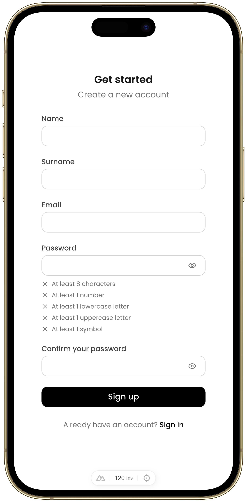
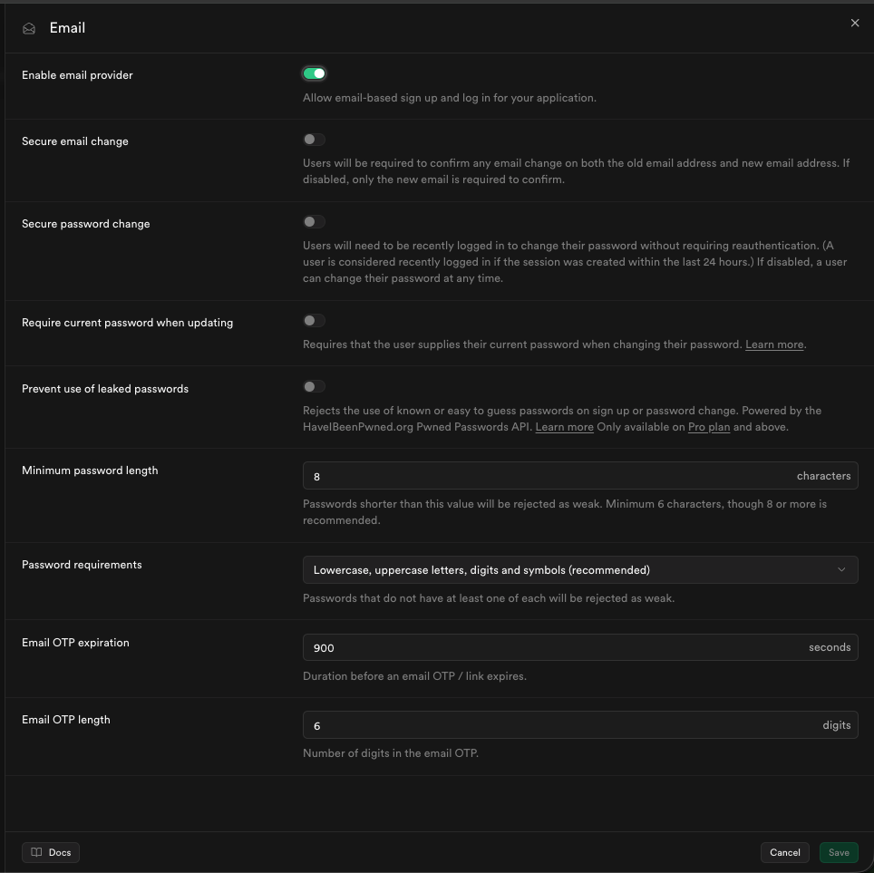
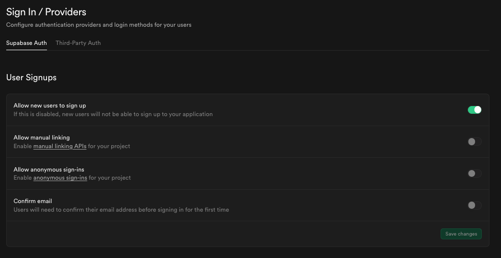
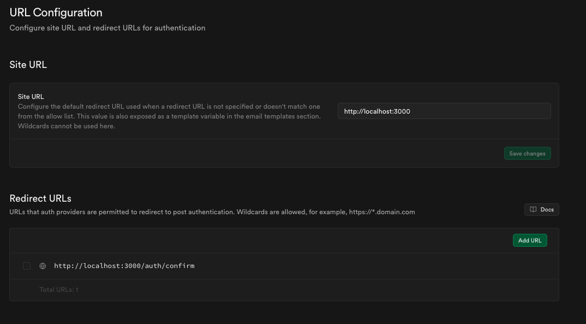

<div align="center">
  
</div>

---

# Nuxt Supabase Auth Scaffold

A production ready Nuxt 4 authentication scaffold powered by Supabase.

## Features

- **Sign up**
- **Sign in**
- **Account recovery methods**
- **Email confirmation**
- **Protected routes**
- **Dark mode**
- **Polished UI**
- **Fine-tuned and friendly error handling**

## Tech Stack

| What          | Package                       |
| ------------- | ----------------------------- |
| Framework     | Nuxt 4                        |
| Auth + DB     | Supabase (`@nuxtjs/supabase`) |
| UI components | Nuxt UI v4                    |
| Validation    | Zod                           |
| Styling       | Tailwind CSS v4               |

## Prerequisites

- Node.js LTS recommended
- A [Supabase](https://supabase.com) project (free tier works)

## Supabase Setup

### 1. Enable Email Auth

Go to **Authentication → Providers → Email** and copy the settings below.



Under **User Signups settings**, you can enable or disable email confirmation, both modes are supported. With confirmation on, sign up shows a "check your inbox" screen and the confirmation link lands the user on their dashboard.



### 2. Configure Redirect URLs

Go to **Authentication → URL Configuration** and add your app URL to **Redirect URLs**:

```
http://localhost:3000/auth/confirm # local development
https://your-domain.com/auth/confirm # production
```



### 3. Get Your API Keys

On your project dashboard click on **connect** and set Nuxt as the framework. Scroll down and copy the `SUPABASE_URL` + `SUPABASE_KEY` values.

For the type generation script (`sb-gen:types`) to work, go to **Account → Access Tokens** and create a new token. This goes into `SUPABASE_ACCESS_TOKEN`.

## Installation

```bash
git clone https://github.com/theosucksatcode/NuxtSupabaseAuthScaffold.git
cd NuxtSupabaseAuthScaffold
cp .env.example .env
```

Fill in `.env` with your Supabase credentials:

```env
NUXT_PUBLIC_SUPABASE_URL="https://example.supabase.co"
NUXT_PUBLIC_SUPABASE_KEY="<your_publishable_key>"
SUPABASE_ACCESS_TOKEN="sbp_xxxxxxxxxxxxxxxxxxxx" # only needed for type generation
SUPABASE_PROJECT_ID="<your_project_id>" # only needed for type generation
```

Then install and run:

```bash
npm install
npm run dev
```

> **First time?** The `app/types/database.types.ts` file ships as a generic placeholder. Once your Supabase schema is set up, run `npm run sb-gen:types` to generate accurate types.

## Project Structure

```
app/
├── pages/
│   ├── index.vue # Landing page
│   ├── auth/
│   │   ├── sign-in.vue
│   │   ├── sign-up.vue
│   │   ├── forgot-password.vue
│   │   └── confirm.vue # Handles PKCE code exchange (email confirm + password reset)
│   └── app/
│       └── dashboard/
│           └── index.vue # Protected page
├── components/
│   ├── SignIn.vue
│   ├── SignUp.vue
│   ├── ForgotPassword.vue
│   └── Confirm.vue
├── composables/
│   └── usePasswordStrength.ts # Shared auth form composable
├── middleware/
│   └── guest.ts # Redirects authenticated users away from auth pages
├── layouts/
│   └── centered.vue
├── utils/
│   └── auth.ts # Shared auth form utilities
└── types/
    └── database.types.ts # Auto generated Supabase schema types
```

## Customization

**Theme** — reference [Nuxt UI docs](https://ui.nuxt.com/docs/getting-started/theme) for this.

**Protected routes** — extend the `include` array in `nuxt.config.ts`:

```ts
supabase: {
  redirectOptions: {
    login: "/auth/sign-in",
    callback: "/auth/confirm",
    include: ["/app/**", "/another-protected-route/**"],
  },
},
```

**Database types** — after changing your Supabase schema, regenerate types:

```bash
npm run sb-gen:types
```
